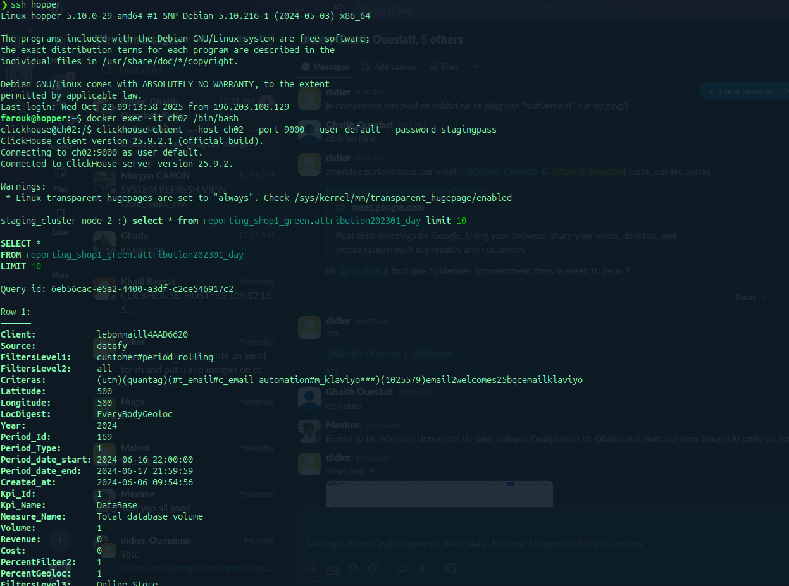

````markdown
🧩 ClickHouse Staging Cluster Restoration Guide

This guide provides step-by-step instructions to **restore the ClickHouse staging cluster environment** on a new host using the backup files and configuration from the [`quanticfactory/clickhouse-staging-cluster`](https://github.com/quanticfactory/clickhouse-staging-cluster) repository.

The cluster includes:

- **2 ClickHouse nodes:** `ch01`, `ch02`  
- **3 ClickHouse Keeper nodes:** `keeper01`, `keeper02`, `keeper03`

---

## ⚙️ Prerequisites

Before starting, ensure the following tools are installed and configured:

| Requirement | Description | Command to Verify |
|--------------|--------------|------------------|
| **Docker & Docker Compose** | Required to run the cluster containers | `docker --version`<br>`docker compose version` |
| **GitHub CLI (optional)** | For downloading release assets | `gh --version` |
| **Git** | For cloning the repository | `git --version` |
| **Disk Space** | Ensure enough disk space for restored volumes | `df -h` |
| **Backup Files** | Access to the repository release `v1.0.0` | Download from GitHub Releases |

> 💡 If any of the above tools are missing, follow their official installation guides.
````

---

## 🚀 Restoration Steps

### 1. Clone the Repository

```bash
git clone https://github.com/quanticfactory/clickhouse-staging-cluster
cd clickhouse-staging-cluster
````

This will create a directory containing:

* `docker-compose.yml`
* Configuration directories (`ch01`, `ch02`, `keeper01`, etc.)
* Scripts:

  * `scripts/restore-volumes.sh`
  * `scripts/backup-volumes.sh`

---

### 2. Download Backup Files

Download the `.tar.gz` backup files from the **v1.0.0** release:

```bash
gh release download v1.0.0
```

You should have under your project directory:

```
clickhouse-staging-cluster_ch01_data.tar.gz
clickhouse-staging-cluster_ch02_data.tar.gz
clickhouse-staging-cluster_keeper01_data.tar.gz
clickhouse-staging-cluster_keeper02_data.tar.gz
clickhouse-staging-cluster_keeper03_data.tar.gz
```

> 🔸 **Alternative:** If `gh` isn’t installed, download them manually from the GitHub [Releases](https://github.com/quanticfactory/clickhouse-staging-cluster/releases) page and place them in the project directory.

---

### 3. Restore Volumes

Run the restore script to restore the volumes from the `.tar.gz` backups:

```bash
cd clickhouse-staging-cluster
chmod +x scripts/restore-volumes.sh
bash scripts/restore-volumes.sh
```

#### 🧰 What the Script Does

* Stops existing Docker Compose services.
* Creates Docker volumes if they don’t exist.
* Restores `.tar.gz` files into their respective volumes.
* Displays a success message when done.

#### ✅ Example Output

```
Restoring clickhouse-staging-cluster_ch01_data.tar.gz → clickhouse-staging-cluster_ch01_data
Restoring clickhouse-staging-cluster_ch02_data.tar.gz → clickhouse-staging-cluster_ch02_data
...
All volumes restored successfully.
```

---

### 4. Start the Cluster

```bash
docker compose up -d
```

This launches the following containers:

```
ch01, ch02, keeper01, keeper02, keeper03
```

---

### 5. Verify the Cluster

#### 🧱 Check Container Status

```bash
docker ps
```

Ensure all containers are **Up** and running.

#### 🗃️ Verify ClickHouse Data

```bash
docker exec -it ch01 clickhouse-client
SELECT * FROM system.tables;
```

Your databases and tables should be restored.

Your data will be restored only on ch02


---
### 6. Fix Replication — Run the Migration Script
 
The restored cluster has a replication bug: all tables were created with `{uuid}` in their
`ReplicatedMergeTree` engine path. Because each node generates its own local UUID at table
creation time, `ch01` and `ch02` register under different Keeper paths and never replicate
to each other.
 
The migration script fixes this by rebuilding each table with a correct shared Keeper path.
 
#### 6.1 Copy the script into the containers
 
```bash
docker cp scripts/migrate_replicated_tables.sh ch01:/tmp/
docker cp scripts/migrate_replicated_tables.sh ch02:/tmp/
```
 
#### 6.2 Run on ch01
 
```bash
docker exec -u root -it ch01 bash /tmp/migrate_replicated_tables.sh \
    --host localhost \
    --password password
```
 
 
#### 6.3 run on ch02
 
```bash
docker exec -u root -it ch02 bash /tmp/migrate_replicated_tables.sh \
    --host localhost \
    --password password
```
 
 
#### 6.4 Verify replication is working
 
**Check all Keeper paths are now correct and identical on both nodes:**
 
```sql
-- Run on both ch01 and ch02 — output must match
SELECT database, table, zookeeper_path, replica_name
FROM system.replicas
ORDER BY database, table;
```
 
---

## 📚 References

* [ClickHouse Documentation](https://clickhouse.com/docs/)
* [ClickHouse Keeper Docs](https://clickhouse.com/docs/en/guides/sre/keeper)
* [Docker Documentation](https://docs.docker.com/)

